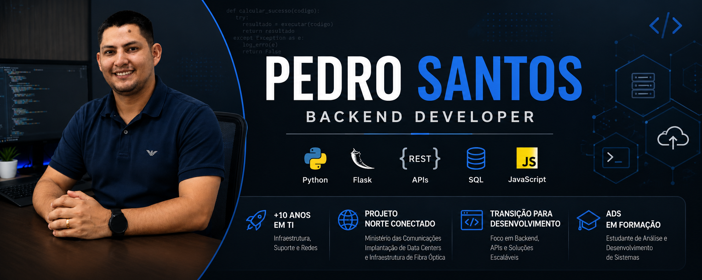

  

<h1 align="center">Olá! Eu sou Pedro Santos 👋</h1>

<h3 align="center">
  Desenvolvedor Backend em formação | Python • Flask • APIs • SQL
</h3>

  Profissional de TI com mais de 10 anos de experiência em Infraestrutura e Suporte Técnico,
  atualmente em transição para Desenvolvimento de Software.

  
  
  

---

## 👨‍💻 Sobre mim

Sou estudante de **Análise e Desenvolvimento de Sistemas** e profissional de TI com mais de **10 anos de experiência em Infraestrutura, Redes e Suporte Técnico**.

Ao longo da minha carreira, atuei com servidores, redes, suporte a usuários, administração de ambientes, banco de dados e implantação de soluções corporativas.

Participei do **Projeto Norte Conectado**, do Ministério das Comunicações, pela empresa **MDC**, contribuindo na implantação de contêineres Data Center destinados ao recebimento da infraestrutura de fibra óptica e à ampliação da conectividade em regiões remotas do Brasil.

Atualmente estou direcionando minha carreira para o **Desenvolvimento Backend**, criando projetos com Python, Flask, APIs, bancos de dados e automação de processos.

---

## 🚀 Tecnologias e ferramentas

  

### Conhecimentos atuais

- **Backend:** Python, Flask, Node.js e APIs REST
- **Frontend:** HTML5, CSS3, JavaScript e Bootstrap
- **Banco de dados:** MySQL, SQLite e SQL
- **Versionamento:** Git e GitHub
- **Infraestrutura:** Redes, servidores, suporte e implantação de ambientes
- **Ferramentas:** VS Code, Postman, Docker e Render

---

## 💼 Experiência profissional

### Virtus Sistemas

Atuação com suporte técnico especializado para sistemas de cartório, análise de logs, banco de dados, correção de arquivos, integrações e atendimento a clientes.

**Principais atividades:**

- Análise e correção de arquivos ONR, SIEX, CRA e DOI
- Consultas e ajustes em bancos de dados SQL
- Investigação de erros em Java, Hibernate, Tomcat e JSF
- Suporte remoto e resolução de incidentes
- Validação de arquivos JSON e TXT
- Apoio em integrações com serviços externos

### Projeto Norte Conectado — MDC

Participação na implantação de contêineres Data Center responsáveis por receber a infraestrutura de fibra óptica do projeto Norte Conectado, do Ministério das Comunicações.

---

## 📌 Projetos em destaque

### 🔧 Sistema de Correção de Arquivos ONR

Aplicação web desenvolvida para interpretar arquivos de erro, localizar registros inconsistentes e gerar arquivos corrigidos para novo envio.

**Tecnologias:** Python, Flask, HTML, CSS, Bootstrap, JSON e TXT.

---

### 🌐 Portal Missionário

Portal institucional com área restrita para acesso a apostilas, videoaulas e outros materiais.

**Tecnologias:** HTML, CSS, JavaScript, Bootstrap, Node.js e SQLite.

---

### 📚 Sistema de Gerenciamento de Apostilas

Aplicação para cadastro, organização e disponibilização de materiais digitais para usuários autorizados.

**Tecnologias:** Python, Flask, SQLite e Bootstrap.

---

## 📊 Estatísticas do GitHub

  
  

  

## 📈 Minha jornada no GitHub

  🚀 Construindo projetos com Python, Flask, JavaScript e SQL 
  📚 Aprendendo continuamente desenvolvimento Backend e APIs REST 
  🛠️ Transformando experiência em Infraestrutura em soluções de software

## 🐍 Contribuições

  

---

## 🎯 Objetivos profissionais

- Conquistar minha primeira oportunidade como Desenvolvedor Backend
- Aprimorar Python e Flask
- Desenvolver APIs REST seguras e bem estruturadas
- Evoluir em testes automatizados e Clean Code
- Aprender Docker, CI/CD e microsserviços
- Contribuir com projetos Open Source
- Criar soluções para problemas reais

---

## 📫 Contato

  
  
  

---

  <em>“A tecnologia move o mundo, mas são as pessoas que fazem a diferença.”</em>

  

